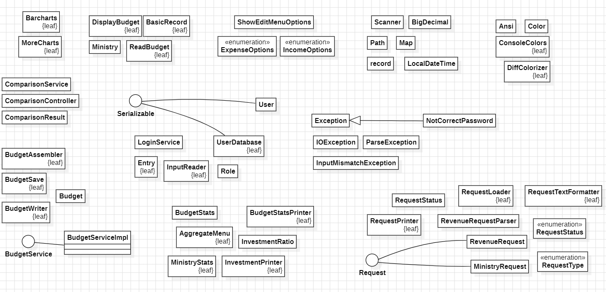

# DhmosiaBytes

🇬🇷 🇬🇧

  

## Ελληνικά

### Περιγραφή

Το έργο κατασκευάστηκε από την ομάδα Δημόσια Bytes στα πλαίσια της ομαδικής εργασίας εξαμήνου με θέμα «Πρωθυπουργός για μια μέρα: Σύστημα επισκόπησης και επεξεργασίας του Κρατικού Προϋπολογισμού». Η εφαρμογή Budget++, η οποία εκτελείται από την γραμμή εντολών, προσφέρει ένα σύστημα διαχείρισης αιτημάτων τροποποίησης του Κρατικού Προϋπολογισμού και πληθώρα στατιστικών.

### 1. Απαιτήσεις & Οδηγίες Μεταγλώττισης – Εκτέλεσης

Από την στήλη Releases του αποθετηρίου ακολουθείται τις παρακάτω οδηγίες:

Προαπαιτούμενο: Java JDK 17+
Για να εκτελέσετε την εφαρμογή, κατεβάστε το επισυναπτόμενο αρχείο .zip και ακολουθήστε τα βήματα:
1.	Αποσυμπίεση: Εξάγετε όλα τα περιεχόμενα σε EΝΑΝ φάκελο.
2.	Runtime Data: Βεβαιωθείτε ότι ο φάκελος runtime-data παραμένει στον ίδιο κατάλογο με το αρχείο .jar.
3.	Εντολή Run: Ανοίξτε το τερματικό σας και αφού μπείτε στο φάκελο που βρίσκονται τα παραπάνω εκτελέστε την παρακάτω εντολή:
   'java -jar BudgetPlusPlus.jar'

! Τοποθετήστε το .zip σε φάκελο που δεν είναι Read-only.

Εναλλακτικά χρησιμοποιώντας το αποθετήριο:

Προαπαιτούμενο: Java JDK 17+   &  Maven Apache 3x
1.	Ανοίγετε το τερματικό 
2.	Κάνετε clone το αποθετήριο εκτελώντας την παρακάτω εντολή από το CLI:
'git clone https://github.com/MyrtoNtokou/DhmosiaBytes.git'
4.	Μεταβείτε στον φάκελο: cd DhmosiaBytes
5.	Μεταγλώττιση με την εντολή: mvn clean package
6.	Εκτέλεση με την εντολή:
'java -jar target/BudgetPlusPlus.jar'

### 2. Οδηγίες Χρήσης

Ο χρήστης μπαίνοντας στην εφαρμογή επιλέγει την ιδιότητα του (Κυβέρνηση, Κοινοβούλιο, Υπουργείο Οικονομικών, Άλλο Υπουργείο). Στη συνέχεια, έχει την δυνατότητα να συνδεθεί σε έναν λογαριασμό, είτε να δημιουργήσει έναν νέο, σύμφωνα με συγκεκριμένους κανόνες. Στους τρεις πρώτους ρόλους, για λόγους ασφαλείας μπορεί να δημιουργηθεί αποκλειστικά ένας λογαριασμός.

Μετά την επιτυχή σύνδεση, ο χρήστης συναντά το βασικό μενού της εφαρμογής. Η πρώτη επιλογή «1. Εμφάνιση Δημοσιευμένου Κρατικού Προϋπολογισμού» εμφανίζει τον Γενικό Προϋπολογισμό με τα έσοδα και τα έξοδα. Η επιλογή «2. Εμφάνιση Δημοσιευμένου Προϋπολογισμού Υπουργείων» εμφανίζει τα έξοδα της Προεδρίας της Δημοκρατίας, της Βουλής των Ελλήνων, της Προεδρίας της Κυβέρνησης, των Υπουργείων και των Αποκεντρωμένων Διοικήσεων. Η επιλογή 3 διαφέρει ανάλογα τον ρόλο του χρήστη.

> Γενικός Προϋπολογισμός: Άρθρο 1 - Κρατικού Προϋπολογισμού

> Προϋπολογισμός Υπουργείων: Άρθρο 2 - Κρατικού Προϋπολογισμού

Τα Άλλα Υπουργεία επιλέγοντας «3. Αιτήματα», μπορούν να δουν «1. Ιστορικό Αλλαγών», όπου φαίνονται οι καταχωρημένες αλλαγές ανά κατηγορία («1. Έσοδα Προϋπολογισμού» / «2. Έξοδα Προϋπολογισμού (ανά Υπουργείο) ). Ακόμη, βλέπουν «2. Σύγκριση Δημοσιευμένου και Τροποποιημένου Προϋπολογισμού», όπου σημειώνονται οι διαφορές μεταξύ των προϋπολογισμών αυτών. Και «3. Υποβολή Αιτημάτων» όπου μπορούν να υποβάλλουν αιτήματα σχετικά με τις ανάγκες τους. Αυτό γίνεται εισάγοντας τον κωδικό του υπουργείου (Α/Α), το είδος του προϋπολογισμού («1. Τακτικός Προϋπολογισμός» / «2. Προϋπολογισμός Δημοσίων Επενδύσεων») και την επιθυμητή αύξηση. Στην συνέχεια γίνεται κατανομή της αύξησης με βάση τις κατηγορίες των εξόδων. Συγκεκριμένα, πρέπει να εισαχθεί ο κωδικός του εξόδου (Α/Α) και το ποσοστό (1-100) μέχρι τα επιμέρους ποσοστά να αθροίζουν στο 100%.
Ο Υπουργός Οικονομικών με την επιλογή «3. Τροποποίηση Στοιχείων Προϋπολογισμού» μπορεί να επιλέξει ανάμεσα σε: 

> Τροποποιημένος Προϋπολογισμός: Προκύπτει από τις τροποποιήσεις που γίνονται εντός της εφαρμογής

«1. Επεξεργασία Προϋπολογισμού», όπου γίνονται αλλαγές είτε στα έσοδα με την εισαγωγή του κωδικού του εσόδου (Α/Α) και του νέου ποσού είτε στα έξοδα με τον ίδιο τρόπο με το Άλλο Υπουργείο. Και τα δύο είδη αλλαγών λαμβάνουν την κατάσταση «REVIEWED_BY_FINANCE_MINISTRY» και υποβάλλονται για περαιτέρω έγκριση. 

«2. Ιστορικό Αλλαγών» και «3. Σύγκριση Δημοσιευμένου και Τροποποιημένου Προϋπολογισμού», τα οποία λειτουργούν όπως αναφέρθηκε.

«4. Προβολή Αιτημάτων από άλλα Υπουργεία», εκεί εμφανίζονται τα αιτήματα των υπουργείων με κατάσταση «PENDING», τα αξιολογεί επιλέγοντας «1. Έγκριση αυτούσιου αιτήματος» (κατάσταση «REVIEWED_BY_FINANCE_MINISTRY») το οποίο θα το υποβάλλει στην κυβέρνηση, «2. Απόρριψη» (κατάσταση REJECTED) και «3. Το αίτημα θα υποβληθεί τροποποιημένο» (κατάσταση «MODIFIED), το έχει δηλαδή λάβει υπόψη του και θα υποβάλλει τροποποίηση εκ νέου. Με αυτό τον τρόπο έχει την δυνατότητα να διατηρεί με άμεση πρόσβαση μόνο τα αιτήματα που δεν έχει επεξεργαστεί.

Η Κυβέρνηση με την επιλογή «3. Αξιολόγηση Τροποποιήσεων Προϋπολογισμού» μπορεί και εκείνη να προβάλλει «1. Ιστορικό Αλλαγών» και «2. Σύγκριση Δημοσιευμένου και Τροποποιημένου Προϋπολογισμού» όπως οι προηγούμενοι. Με την επιλογή «3. Προβολή Τροποποιήσεων» εμφανίζει τις αλλαγές που προέρχονται από τον Υπουργό Οικονομικών (με κατάσταση REVIEWED_BY_FINANCE_MINISTRY) ανά κατηγορία («1. Έσοδα Προϋπολογισμού» / «2. Έξοδα Προϋπολογισμού (ανά Υπουργείο) ). Και στις δύο κατηγορίες έχει την δυνατότητα για «1. Έγκριση» (κατάσταση GOVERNMENT_APPROVED) με το οποίο κατατίθεται για τελική αξιολόγηση από το Κοινοβούλιο και για «2. Απόρριψη».

Το Κοινοβούλιο βλέπει τις ίδιες επιλογές με την Κυβέρνηση. Ωστόσο, όταν επιλέξει «3. Προβολή Τροποποιήσεων» εμφανίζει τις εγκεκριμένες από την Κυβέρνηση αλλαγές (με κατάσταση GOVERNMENT_APPROVED) ανά κατηγορία («1. Έσοδα Προϋπολογισμού» / «2. Έξοδα Προϋπολογισμού (ανά Υπουργείο) ). Ακόμη, με την επιλογή «1. Έγκριση» (κατάσταση PARLIAMENT_APPROVED) οι αλλαγές αποθηκεύονται και καταχωρούνται στο αρχείο με τον Τροποποιημένο Προϋπολογισμό. Οι αλλαγές με αυτή την κατάσταση είναι και αυτές που εμφανίζονται στο Ιστορικό Αλλαγών.

Με την επιλογή «4. Συγκεντρωτικά Στοιχεία» προκύπτουν δύο επιλογές «1. Γενικός Προϋπολογισμός» και «2. Προϋπολογισμός Υπουργείων». Στο πρώτο εμφανίζονται οι Μέγιστες Πηγές Εσόδων και οι Μέγιστοι Τομείς Εξόδων με ποσοστά ως προς το σύνολο των εσόδων και των εξόδων αντίστοιχα. Επίσης, καταγράφονται και οι Ελάχιστες Πηγές Εσόδων και οι Ελάχιστοι Τομείς Εξόδων. Στο δεύτερο μπορεί να δει την «1. Ανάλυση Μέγιστων Δαπανών», όπου φαίνονται οι Μέγιστες Δαπάνες Τακτικού Προϋπολογισμού, Δημοσίων Επενδύσεων και οι Συνολικές. Για κάθε μία από αυτές υπολογίζονται τα ποσοστά τους ως προς το σύνολο κάθε κατηγορίας αντίστοιχα. Ακόμη, διαλέγοντας «2. Δείκτες Λόγου Επενδύσεων», υπολογίζεται το ποσοστό του Προϋπολογισμού Δημοσίων Επενδύσεων ως προς το σύνολο για κάθε υπουργείο και ταξινομούνται σε φθίνουσα σειρά. 
Με την επιλογή «5. Σύγκριση Κρατικού Προϋπολογισμού Διαφορετικών Ετών» ο χρήστης έχει τη δυνατότητα να δει τη μεταβολή ενός στοιχείου του προϋπολογισμού μεταξύ δύο ετών. Συγκεκριμένα μπορεί να επιλέξει ανάμεσα στα «1. Γενικός Προϋπολογισμός» και «2. Προϋπολογισμός Υπουργείων» και στη συνέχεια να επιλέξει δύο έτη σύγκρισης, καθώς και τον κωδικό (Α/Α) του στοιχείου που θέλει να συγκρίνει.

Ο χρήστης επιλέγοντας «6. Γραφήματα » μπορεί να επιλέξει ανάμεσα σε πληθώρα γραφημάτων. Συγκεκριμένα οι επιλογές περιλαμβάνουν «1. Πίτα Συνολικών Εσόδων - Εξόδων», «2. Ιστόγραμμα Εσόδων», «3. Ιστόγραμμα Εξόδων», «4. Ιστόγραμμα Προϋπολογισμού ανά Υπουργείο» αυτά (1-4) αφορούν το τρέχον έτος. Επίσης μπορεί να επιλέξει «5. Γραμμικό διάγραμμα εσόδων εξόδων για τα έτη 2020-2026», «6. Ιστόγραμμα για συγκεκριμένο έσοδο 2020-2026» «7. Ιστόγραμμα για συγκεκριμένο έξοδο 2020-2026» «8. Ιστόγραμμα ανά Υπουργείο για τα έτη 2020-2026». Στις επιλογές (6-8) αφού εισάγει τον αντίστοιχο αριθμό επιλέγει το συγκεκριμένο στοιχείο που επιθυμεί να δει πληκτρολογώντας τον (Α/Α) από τη λίστα των στοιχείων που εμφανίζονται.

Σε κάθε στάδιο έχουν οι χρήστες την δυνατότητα να επιστρέψουν σε προηγούμενες καταστάσεις με την επιλογή «0. Έξοδος». Όλοι οι κωδικοί (Α/Α) και τα ονόματα φαίνονται από πίνακες κάθε φορά.

### 3. Λειτουργικότητα

Η εφαρμογή αποτελεί ένα σύστημα διαχείρισης, τροποποίησης και ανάλυσης του Κρατικού Προϋπολογισμού. Η ασφάλεια του συστήματος βασίζεται στον περιορισμό δημιουργίας ενός μοναδικού λογαριασμού για τους κεντρικούς θεσμικούς ρόλους, όπως η Κυβέρνηση, το Κοινοβούλιο και το Υπουργείο Οικονομικών, υποστηρίζοντας μια ροή εργασιών που ξεκινά από την υποβολή αιτημάτων των Υπουργείων και καταλήγει στην τελική κύρωση.

Παράλληλα, το σύστημα προσφέρει ιστορικό αλλαγών και εργαλεία σύγκρισης μεταξύ του αρχικά δημοσιευμένου και του τροποποιημένου προϋπολογισμού, επιτρέποντας την αποτύπωση της εξέλιξης της οικονομικής πολιτικής. Επιπλέον μέσω των συγκεντρωτικών στοιχείων, η εφαρμογή παρέχει απεικόνιση των μέγιστων και ελάχιστων εσόδων και εξόδων του Γενικού Προϋπολογισμού, καθώς και ανάλυση των δαπανών των Υπουργείων. Ακόμη, παρέχει τους δείκτες επενδύσεων των Υπουργείων οι οποίοι δείχνουν τον αναπτυξιακό προσανατολισμό κάθε Υπουργείου και πόσα από τα χρήματα που διαχειρίζεται κατευθύνονται σε επενδύσεις και πόσα σε τρέχουσες δαπάνες.

Τέλος, η εφαρμογή επιτρέπει την σύγκριση στοιχείων μεταξύ των ετών 2020-2026, μέσω της οποία αποτυπώνεται μια εικόνα της δημοσιονομικής κατεύθυνσης του κράτους και την εξέλιξης της οικονομικής πολιτικής. Σε συνδυασμό, με την οπτικοποίηση οικονομικών δεδομένων μέσω γραφημάτων, όπως πίτες, ιστογράμματα και γραμμικά διαγράμματα για τη διαχρονική παρακολούθηση εσόδων και εξόδων επιτρέπει την εξαγωγή συμπερασμάτων σχετικά με τη δημοσιονομική στρατηγική και τις οικονομικές προτεραιότητες του κράτους.

### 4. Περιορισμοί

•	Αν προκύψει ανάγκη για προϋπολογισμό άλλου έτους ή έκτακτο προϋπολογισμό, ο κώδικας θα χρειαστεί χειροκίνητες τροποποιήσεις.

•	Η εφαρμογή λειτουργεί ως standalone desktop application. Οποιαδήποτε αλλαγή ή αποθήκευση δεδομένων πραγματοποιείται τοπικά στα αρχεία του φακέλου runtime-data. Δεν υποστηρίζεται αυτόματος συγχρονισμός μεταξύ διαφορετικών χρηστών ή υπολογιστών.

•	Γίνεται ανάγνωση αρχείων και αποθήκευση από συγκεκριμένο classpath, το οποίο μπορεί να δημιουργήσει προβλήματα ειδικά σε περιβάλλοντα read-only.

### 5. Κίνδυνοι Χρήσης 

•	Η κλάση UserDatabase δημιουργεί κενά ασφάλειας καθώς δεν διαθέτει υποστήριξη εξωτερικής βάσης δεδομένων και συνεπώς τα στοιχεία των χρηστών είναι αποθηκευμένα με σκληρή κωδικοποίηση στον κώδικα.

•	Τα αρχεία CSV για την επεξεργασία και αποθήκευση δεδομένων μέσω των λειτουργιών BudgetEditor και BudgetSave εγκυμονεί κινδύνους για την ακεραιότητα της πληροφορίας, διότι δεν υπάρχει μηχανισμός κλειδώματος εγγραφών το οποίο καθιστά τα δεδομένα ευάλωτα σε διαφθορά ή απώλεια σε περίπτωση ταυτόχρονης πρόσβασης από πολλαπλούς χρήστες.

### 6. Δομή Αποθετηρίου

Το αποθετήριο είναι οργανωμένο για ένα Java project με βάση την δομή του Maven:

•	.github/workflows: Περιέχει τις ρυθμίσεις για το CI/CD pipeline (GitHub Actions), όπως το αυτοματοποιημένο build και το upload στο GitHub Pages.

•	diagrams/: αποθήκευση του UML της εφαρμογής για αξιοποίηση στο README.md

•	src/: Ο κύριος φάκελος με τον πηγαίο κώδικα της εφαρμογής (Source Code).

•	runtime-data/: Φάκελος που περιλαμβάνει δεδομένα που χρησιμοποιούνται κατά την εκτέλεση του προγράμματος.

•	pom.xml: Το βασικό αρχείο ρυθμίσεων του Maven, που περιέχει τις εξαρτήσεις και τους κανόνες του project.

•	dependency-reduced-pom.xml: Βοηθητικό από το Maven Shade plugin κατά το build.

•	.gitignore: Ορίζει ποια αρχεία και φάκελοι δεν να ανεβαίνουν στο αποθετήριο.

•	LICENSE: Η άδεια χρήσης του λογισμικού (MIT License).

•	README.md: Το αρχείο με τις γενικές πληροφορίες και τις οδηγίες χρήσης του έργου.

### 7. Σχεδιασμός & Αρχιτεκτονική 

Η σχεδίαση της εφαρμογής ακολουθεί τις αρχές της αντικειμενοστραφούς προγραμματιστικής προσέγγισης. Συγκεκριμένα, χρησιμοποιούνται τρεις διεπαφές (οι Serializable, BudgetService και Request) για την διαχείριση χρηστών, αλλαγών στον  Προϋπολογισμό τόσο των εσόδων όσο και των υπουργείων που αλληλεπιδρά με τα έξοδα και για διαχείριση αιτημάτων μεταξύ των βασικών θεσμικών ρόλων. Επιπλέον επεκτείνεται η κλάση Exception για χειρισμό λάθους εισαγωγής password από τον χρήστη με περιορισμένες προσπάθειες. Για την διασφάλιση της ακεραιότητας των λογαριασμών καθώς διαφέρουν οι λειτουργίες που μπορεί να πραγματοποιήσει ο κάθε ρόλος αξιοποιείται η Singleton, μέσω της οποίας δημιουργείται αποκλειστικά ένας λογαριασμός για το Υπουργείο Οικονομικών, την Κυβέρνηση και το Κοινοβούλιο.

### 8. Δομές Δεδομένων & Αλγόριθμοι

•	Βασικές Δομές Δεδομένων:
Η εφαρμογή αντλεί τα δεδομένα από CSV και τα ενσωματώνει σε δομημένα αντικείμενα. Οι κύριες οντότητες προκύπτουν από κλάσεις όπως Budget, Ministry και Entry, οι οποίες μοντελοποιούν τον προϋπολογισμό, τα μεμονωμένα υπουργεία, έσοδα και έξοδα. Επίσης, χρησιμοποιούνται δομές όπως η MinistryRequest και η RevenueRequest οι οποίες αναπαριστάνουν τα αιτήματα και αντιστοιχα Services και Repositories που τα διαχειρίζονται. Για την ανάλυση αυτών των αντικειμένων, χρησιμοποιούνται συλλογές όπως οι πίνακες κατακερματισμού (Maps) για τη συσχέτιση κωδικών και ποσών, καθώς και δυναμικές λίστες (Lists) για την ομαδοποίηση αποτελεσμάτων. Επιπλέον, για την διασφάλιση σταθερών καταστάσεων αξιοποιούνται Enums.

•	Κύριοι Αλγόριθμοι:
Αρχικά, η μετατροπή των πρωτογενών δεδομένων πραγματοποιείται μέσω αλγορίθμων CSV parsing που μετασχηματίζουν τα αρχεία κειμένου σε αντικείμενα Java. Ακόμη, χρησιμοποιούνται αλγόριθμοι ανάλυσης και στατιστικής για  την άθροιση δεδομένων ανά κατηγορία και τον υπολογισμό επενδυτικών δεικτών και ποσοστών για την αξιολόγηση της οικονομικής πολιτικής. Συνδυαστικά, χρησιμοποιούνται αλγόριθμοι ταξινόμησης και εντοπισμού μέγιστων και ελάχιστων μεγεθών. Για την επίτευξη συγκρίσεων, αξιοποιούνται ειδικοί αλγόριθμοι (diff algorithms) που εντοπίζουν διαφορές μεταξύ στοιχείων του προϋπολογισμού διαχρονικά. Για τον ίδιο σκοπό, το σύστημα περιλαμβάνει αλγορίθμους οπτικοποίησης για τη δημιουργία γραφημάτων. Ένας ακόμη αλγόριθμος είναι αυτός που χρησιμοποιείται για τον έλεγχο πρόσβασης για τη διαχείριση συνεδριών των χρηστών. Τέλος,  σε όλες τις εκτυπώσεις του προγράμματος έχουν ενσωματωθεί μηχανισμοί μορφοποίησης κειμένου για την ευανάγνωστη παρουσίαση των αποτελεσμάτων στην κονσόλα.

### 9. Τεχνική Τεκμηρίωση

•	JavaDoc: Τεχνική Τεκμηρίωση όλου του κώδικα

[📖 Τεκμηρίωση Javadoc](https://myrtontokou.github.io/DhmosiaBytes/docs/index.html)

•	JaCoCo: Reports κάλυψης κώδικα

[📖 Κάλυψη Javadoc](https://myrtontokou.github.io/DhmosiaBytes/coverage/index.html)

### 10. Προτροπές & Απαντήσεις ΠΤΝ

Τα εργαλεία Τεχνητής Νοημοσύνης που χρησιμοποιήθηκαν είναι το ChatGPT, το Gemini, και το Copilot. Αξιοποιήθηκαν τόσο για τον εντοπισμό των κατάλληλων βιβλιοθηκών όσο και για την υλοποίηση του προγράμματος μας. Επιπρόσθετα, την εκμεταλλευτήκαμε για προβλήματα που προέκυπταν στη μεταγλώττιση, από το spotbugs ή από το checkstyle για την πιο άμεση και αποτελεσματική επίλυση τους. Βασικό ρόλο έπαιξε στην συγγραφή των test, καθώς παρήγαγε γρήγορα τα δεδομένα που πρέπει να εισαχθούν σε αυτά για πλήρη κάλυψη αλλά και μας βοήθησε σημαντικά με το Junit. Με την καθοδήγηση της ΠΤΝ, χρησιμοποιήθηκαν Mock αντικείμενα ή dummy δεδομένα για την απομόνωση λειτουργιών και assertions για τον τελικό έλεγχο. Τέλος, είχε συμβουλευτικό ρόλο για καλύτερες πρακτικές, όπως τα Java Streams, και ως προς την αξιοποίηση των αντικειμένων σχεδιάζοντας τα πεδία, ώστε να συγκροτούν πολλές πληροφορίες σχετικά με το αποτέλεσμα της ανάλυσης που έχει προηγηθεί σε κάθε περίπτωση.

### 11. Άδειες Χρήσης 

•	Άδεια Χρήσης (Project License):
Το παρόν λογισμικό παρέχεται υπό την άδεια MIT License, είναι ελεύθερο προς χρήση, αντιγραφή και τροποποίηση, αρκεί να συμπεριλαμβάνεται η αρχική δήλωση πνευματικών δικαιωμάτων.

•	Βιβλιοθήκες Τρίτων:
Για την ανάπτυξη της εφαρμογής, χρησιμοποιούνται οι παρακάτω βιβλιοθήκες ανοιχτού κώδικα οι οποίες φαίνονται με όλες τις εξαρτήσεις, τις εκδόσεις τους και τις αντίστοιχες άδειες χρήσης τους εδώ: 
[📖 Άδειες Χρήσης](https://myrtontokou.github.io/DhmosiaBytes/dependencies.html)

** Συγκεντρωτικά οι Τεχνικές Πληροφορίες: **
[📖 GitHub Pages](https://myrtontokou.github.io/DhmosiaBytes/)

## English

Description

This project was developed by the "Dhmosia Bytes" team as part of a semester group project titled "Prime Minister for a Day: National Budget Overview and Editing System." The **Budget++** application, which runs via the command line, offers a management system for National Budget modification requests and a wide range of statistics.

### 1. Requirements & Compilation – Execution Instructions

Follow the instructions below from the "Releases" column of the repository:

1. Prerequisite: Java JDK 17+ To run the application, download the attached .zip file and follow these steps:
2. Unzip: Extract all contents into ONE folder.
3. Runtime Data: Ensure the «runtime-data» folder remains in the same directory as the .jar file.
4. Run Command: Open your terminal, navigate to the folder containing the above files, and execute the following command:
'java -jar BudgetPlusPlus.jar'

! Place the .zip in a folder that is not Read-only.

Alternatively, using the repository:

1. Prerequisites: Java JDK 17+ & Maven Apache 3x
2. Open the terminal.
3. Clone the repository by executing the following command from the CLI:
'git clone https://github.com/MyrtoNtokou/DhmosiaBytes.git'
4. Navigate to the folder: cd DhmosiaBytes
5. Compile with the command: mvn clean package
6. Execute with the command:
'java -jar target/BudgetPlusPlus.jar'

### 2. Instructions for Use

Upon entering the application, the user selects their role («Κυβέρνηση», «Κοινοβούλιο», «Υπουργείο Οικονομικών», «Άλλο Υπουργείο»). Then, they can log in to an account or create a new one according to specific rules. For the first three roles, only one account can be created for security reasons.

After a successful login, the user encounters the application's main menu. The first option «1. Εμφάνιση Δημοσιευμένου Κρατικού Προϋπολογισμού» displays the General Budget* with revenues and expenses. Option «2. Εμφάνιση Δημοσιευμένου Προϋπολογισμού Υπουργείων»** displays the expenses of the Presidency of the Republic, the Hellenic Parliament, the Presidency of the Government, Ministries, and Decentralized Administrations. Option 3 varies depending on the user's role.

> General Budget: Article 1 - National Budget

> Ministry Budget: Article 2 - National Budget

By selecting «3. Αιτήματα», Other Ministries («Άλλα Υπουργεία») can view «1. Ιστορικό Αλλαγών», which shows registered changes per category («1. Έσοδα Προϋπολογισμού» / «2. Έξοδα Προϋπολογισμού (ανά Υπουργείο)»). They can also see «2. Σύγκριση Δημοσιευμένου και Τροποποιημένου Προϋπολογισμού», which highlights differences between these budgets, and «3. Υποβολή Αιτημάτων» where they can submit requests regarding their needs. This is done by entering the ministry code (A/A), the type of budget («1. Τακτικός Προϋπολογισμός» / «2. Προϋπολογισμός Δημοσίων Επενδύσεων»), and the desired increase. Subsequently, the increase is distributed based on expense categories. Specifically, the expense code (A/A) and the percentage (1-100) must be entered until the individual percentages add up to 100%.

> Modified Budget: Results from the modifications made within the application

The Minister of Finance («Υπουργός Οικονομικών»), with the option «3. Τροποποίηση Στοιχείων Προϋπολογισμού», can choose between:

«1. Επεξεργασία Προϋπολογισμού»: Changes are made either to revenues by entering the revenue code (A/A) and the new amount, or to expenses in the same way as the "Other Ministry". Both types of changes receive the status «REVIEWED_BY_FINANCE_MINISTRY» and are submitted for further approval.

«2. Ιστορικό Αλλαγών» and «3. Σύγκριση Δημοσιευμένου και Τροποποιημένου Προϋπολογισμού»: These function as mentioned above.

«4. Προβολή Αιτημάτων από άλλα Υπουργεία»: This displays requests from ministries with a «PENDING» status. The Minister evaluates them by selecting «1. Έγκριση αυτούσιου αιτήματος» (status «REVIEWED_BY_FINANCE_MINISTRY»), which will be submitted to the government, «2. Απόρριψη» (status «REJECTED»), or «3. Το αίτημα θα υποβληθεί τροποποιημένο» (status «MODIFIED»), meaning it has been taken into account and a new modification will be submitted. This allows immediate access only to unprocessed requests.

The Government («Κυβέρνηση»), with the option «3. Αξιολόγηση Τροποποιήσεων Προϋπολογισμού», can also view «1. Ιστορικό Αλλαγών» and «2. Σύγκριση Δημοσιευμένου και Τροποποιημένου Προϋπολογισμού». By selecting «3. Προβολή Τροποποιήσεων», it displays changes coming from the Minister of Finance (with status «REVIEWED_BY_FINANCE_MINISTRY») per category («1. Έσοδα Προϋπολογισμού» / «2. Έξοδα Προϋπολογισμού (ανά Υπουργείο)»). In both categories, there is the option for «1. Έγκριση» (status «GOVERNMENT_APPROVED»), which submits it for final evaluation by Parliament, and «2. Απόρριψη».

The Parliament («Κοινοβούλιο») sees the same options as the Government. However, when selecting «3. Προβολή Τροποποιήσεων», it displays changes approved by the Government (with status «GOVERNMENT_APPROVED») per category («1. Έσοδα Προϋπολογισμού» / «2. Έξοδα Προϋπολογισμού (ανά Υπουργείο)»). Additionally, with the option «1. Έγκριση» (status «PARLIAMENT_APPROVED»), changes are saved and recorded in the Modified Budget file. Changes with this status are those that appear in the «Ιστορικό Αλλαγών».

With option «4. Συγκεντρωτικά Στοιχεία», two options arise: «1. Γενικός Προϋπολογισμός» and «2. Προϋπολογισμός Υπουργείων». The first displays Maximum Revenue Sources and Maximum Expense Sectors as percentages of total revenue and expenses, respectively. Minimum Revenue Sources and Minimum Expense Sectors are also recorded. In the second, the user can see «1. Ανάλυση Μέγιστων Δαπανών», showing Maximum Regular Budget Expenditures, Public Investment Expenditures, and Totals. For each, percentages are calculated relative to the total of each category. Furthermore, by choosing «2. Δείκτες Λόγου Επενδύσεων», the percentage of the Public Investment Budget relative to the total for each ministry is calculated and sorted in descending order.

With option «5. Σύγκριση Κρατικού Προϋπολογισμού Διαφορετικών Ετών», the user can see the change in a budget item between two years. Specifically, they can choose between «1. Γενικός Προϋπολογισμός» and «2. Προϋπολογισμός Υπουργείων», then select two years for comparison and the code (A/A) of the item to compare.

By selecting «6. Γραφήματα», the user can choose from various charts. Specifically, options include «1. Πίτα Συνολικών Εσόδων - Εξόδων», «2. Ιστόγραμμα Εσόδων», «3. Ιστόγραμμα Εξόδων», «4. Ιστόγραμμα Προϋπολογισμού ανά Υπουργείο» (these 1-4 concern the current year). They can also select «5. Γραμμικό διάγραμμα εσόδων εξόδων για τα έτη 2020-2026», «6. Ιστόγραμμα για συγκεκριμένο έσοδο 2020-2026», «7. Ιστόγραμμα για συγκεκριμένο έξοδο 2020-2026», and «8. Ιστόγραμμα ανά Υπουργείο για τα έτη 2020-2026». For options 6-8, after entering the corresponding number, the user selects the specific item they wish to view by typing the (A/A) from the displayed list.

At every stage, users can return to previous states by selecting «0. Έξοδος». All codes (A/A) and names are shown in tables each time.

## 3. Functionality

The application is a management, modification, and analysis system for the National Budget. System security is based on restricting the creation of a single account for central institutional roles (Government, Parliament, Ministry of Finance), supporting a workflow that begins with Ministry request submissions and ends with final ratification.

Simultaneously, the system offers a change history and comparison tools between the initially published and the modified budget, allowing for a clear view of economic policy evolution. Furthermore, through summary data, the application provides a visualization of maximum and minimum revenues and expenses of the General Budget, as well as an analysis of Ministry expenditures. It also provides investment indicators for Ministries, which show the developmental orientation of each Ministry and how much of the money managed is directed toward investments versus current expenditures.

Finally, the application allows for the comparison of data between the years 2020-2026, capturing an image of the state's fiscal direction and the evolution of economic policy. Combined with the visualization of financial data through charts—such as pie charts, histograms, and line graphs for long-term tracking of revenues and expenses—it enables the extraction of conclusions regarding the state's fiscal strategy and economic priorities.

### 4. Limitations

If a need arises for a budget of another year or an extraordinary budget, the code will require manual modifications.

The application operates as a standalone desktop application. Any changes or data storage occur locally in the files of the «runtime-data» folder. Automatic synchronization between different users or computers is not supported.

Files are read from and saved to a specific classpath, which may cause issues, especially in read-only environments.

### 5. Usage Risks

The «UserDatabase» class creates security gaps as it lacks external database support; therefore, user data is stored with hardcoding in the code.

The use of CSV files for processing and storing data via the «BudgetEditor» and «BudgetSave» functions poses risks to information integrity, as there is no record-locking mechanism, making data vulnerable to corruption or loss in case of simultaneous access by multiple users.

### 6. Repository Structure

The repository is organized for a Java project based on the Maven structure:

•	.github/workflows: Contains settings for the CI/CD pipeline (GitHub Actions).

•	diagrams/: Storage of the application's UML for use in README.md.

•	src/: The main folder with the application's source code.

•	runtime-data/: Folder containing data used during program execution.

•	pom.xml: The basic Maven configuration file.

•	dependency-reduced-pom.xml: Auxiliary file from the Maven Shade plugin.

•	.gitignore: Defines files and folders not to be uploaded.

•	LICENSE: The software license (MIT License).

•	README.md: The file with general information and usage instructions.

### 7. Design & Architecture

The application design follows Object-Oriented Programming principles. Specifically, three interfaces are used («Serializable», «BudgetService», and «Request») for managing users, budget changes (both revenue and ministry-related expenses), and request management between institutional roles. Additionally, the «Exception» class is extended to handle incorrect password entries with limited attempts. To ensure account integrity—since the functions each role can perform differ—the «Singleton» pattern is utilized to create exclusively one account for the Ministry of Finance, the Government, and the Parliament.

### 8. Data Structures & Algorithms

Basic Data Structures: The application pulls data from CSV and incorporates it into structured objects. Main entities stem from classes like «Budget», «Ministry», and «Entry». Structures like «MinistryRequest» and «RevenueRequest» represent requests, with corresponding Services and Repositories managing them. Collections such as «Maps» (for correlating codes and amounts) and «Lists» (for grouping results) are used. «Enums» are utilized to ensure stable states.

Main Algorithms: Data transformation is performed via CSV parsing algorithms. Analysis and statistical algorithms are used for aggregating data and calculating investment indices. Sorting and min/max detection algorithms are also employed. For comparisons, specific «diff algorithms» identify differences over time. Visualization algorithms generate the charts. An access control algorithm manages user sessions, and text formatting mechanisms ensure readable console output.

### 9. Technical Documentation

JavaDoc: 
Technical Documentation of the entire code:
[📖 JavaDoc Report ](https://myrtontokou.github.io/DhmosiaBytes/docs/index.html)

JaCoCo: 
Code coverage reports:
[📖 JaCoCo Coverage ](https://myrtontokou.github.io/DhmosiaBytes/coverage/index.html)

### 10. AI Prompts & Responses

AI tools used include ChatGPT, Gemini, and Copilot. They were utilized for identifying libraries and implementing the program. Additionally, they were used for resolving compilation issues and errors from «spotbugs» or «checkstyle». They played a key role in writing tests, quickly generating data for Junit, and guiding the use of «Mock» objects and «assertions». Finally, AI had a consultative role for best practices, such as «Java Streams», and designing object fields for effective data analysis.

### 11. Licenses

Project License: 
This software is provided under the MIT License.

Third-Party Libraries: 
A full list of open-source libraries, dependencies, and their licenses can be found here:
[📖 Licenses ](https://myrtontokou.github.io/DhmosiaBytes/dependencies.html)

Summary Technical Information via GitHub Pages: 
[📖 GitHub Pages](https://myrtontokou.github.io/DhmosiaBytes/)
